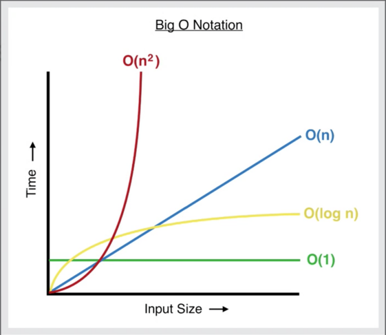

# Data Structures & Algorithms

---

## Algorithm

A **process or set of steps** to solve a certain problem.

**In other terms:**

```
Input ---> Algorithm ---> Output
```

### Steps to Solve Problems

1. **Understand the Problem**
2. **Explore Concrete Examples**
3. **Break it Down**
4. **Solve/Simplify**
5. **Look Back and Refactor**

### Solution Approaches

**Naive Solution:**
Straightforward attempt to solve a problem. In most cases, might not be the best solution.

**Trivial Solution:**
Best approach to solve the problem or optimal solution.

---

## Common Problem Solving Patterns

- **[Frequency Counter](Common%20Patterns/Frequency%20Counter)**  
  Uses objects or maps to count occurrences/frequencies of values, often to compare data or detect duplicates in linear time.
- **[Multiple Pointers](Common%20Patterns/Multiple%20Pointers)**  
  Uses two or more pointers/indexes that move through a structure (usually arrays) to find pairs, ranges, or counts without nested loops.
- **[Sliding Window](Common%20Patterns/Sliding%20Window)**  
  Maintains a window (contiguous subset) over a data structure to track sums, counts, or other metrics while moving the window efficiently.
- **[Back Tracking](Common%20Patterns/Back%20Tracking)**  
  Builds solutions incrementally and abandons a partial solution (backtracks) as soon as it can no longer lead to a valid complete solution.
- **[Greedy Algorithms](Common%20Patterns/Greedy%20Algorithms)**  
  Makes the locally optimal choice at each step with the hope of finding a global optimum, often used for optimization problems.
- **[Recursion](Common%20Patterns/Recursion)**  
  Solves a problem by having a function call itself with smaller inputs until reaching a base case, then combining the results.
  Inbuilt JS functions like `JSON.parse` / `JSON.stringify` also use recursion under the hood.

---

## Big O (Time Complexity)

To describe the **run time complexity** of the function — the relation between the **execution time** and **input** of the function.

**Examples:**

| Description      | Notation |
| ---------------- | -------- |
| f(n) is linear   | O(n)     |
| f(n) is constant | O(1)     |



---

## Big θ (Space Complexity)

To describe the **space (memory) complexity** of the function — the relation between the **memory space** and **input** of the function.

- **Auxiliary space complexity** → Space required by the algorithm itself (excluding input).

**Rules of thumb:**

| Type                               | Space |
| ---------------------------------- | ----- |
| Booleans, numbers, null, undefined | O(1)  |
| Strings, Arrays, Objects           | O(n)  |

---

## Logarithms

The **inverse of exponentiation** — in the same way division is the inverse of multiplication.

**Example:**

```
log₂(8) = 3     ⟺     2³ = 8
```

**General form:**

```
log₂(value) = exponent     ⟺     2^exponent = value
```

---

## Searching Algorithms

To find whether the given value exists in the data.

**Most common ways to implement:**

- **[Linear Search](Searching%20Algorithms/Linear%20Search)**
- **[Binary Search](Searching%20Algorithms/Binary%20Search)**

**Inbuilt JS methods that use searching algorithms:**

- **indexOf()**
- **includes()**
- **find()**
- **findIndex()**

### [Linear Search](Searching%20Algorithms/Linear%20Search)

Iterate over the data and check each value for a match. If the value matches, return `true` (or the index). Else, return `false` (or `-1`).

- **Time Complexity**: \(O(n)\)

### [Binary Search](Searching%20Algorithms/Binary%20Search)

1. Working using the **divide and conquer** method. To implement this we need `start` (0), `end` (length of the data) and `middle` \((left + right) / 2\).
2. Compare whether the middle value matches the target; if yes, return `true` (or the index).
3. If not, check if the target value is **greater** than the middle value. If yes, move `start` to `middle` and calculate the middle again.
4. Else, the middle is **less** than the target value; move `end` to `middle` and calculate the middle again.
5. Repeat the process until `start` and `end` are equal. If there is still no match, return `false` (or `-1`).

- **Time Complexity**: \(O(\log n)\)

### [Naive String (Sub-string) Search](Searching%20Algorithms/Naive%20Search)

Iterate over the data and use another iteration to find the match.  
Create a variable to track the count; if at any point the current characters don’t match, break the inner loop. Else, if the count and found length match, increment the count. At the end, return the count value.

- **Time Complexity**: \(O(n^2)\)

---

## Sorting Algorithms

To sort the data in a particular order (ascending/descending).

JS engines use various approaches to handle sorting. **V8** (Chrome, Node.js, Edge, etc.) typically uses **Timsort** for typical arrays, which is a hybrid algorithm derived from **Merge Sort** and **Insertion Sort**. **Firefox's** engine uses a **Merge Sort**.

By default, if no comparison function is provided, the `sort()` method converts array elements into strings and sorts them based on their UTF-16 code unit values, which often leads to incorrect results for numbers.

**Most common ways to implement:**

- Quick Sort
- Radix Sort
- Heap Sort
- Merge Sort
- Bubble Sort
- Insertion Sort
- Selection Sort

### [Bubble Sort](Sorting%20Algorithms/Bubble%20Sort)

Iterate over the data, and use another iteration to compare the current value and the next value. If the current value is greater than the next value, swap the values.

- **Time Complexity**: \(O(n^2)\)

**Optimization technique:**  
If it’s almost sorted data, we can check if the sorting is done (no swapping) from the previous iteration. If yes, break the loop and return the sorted array.

### [Selection Sort](Sorting%20Algorithms/Selection%20Sort)

Unlike Bubble Sort, here we find the smallest element in the unsorted portion and swap it into its correct position. Iterate over the data, and for each position use another iteration to compare the current value with the smallest value found so far. If the smallest value is greater than the current value, update the smallest element to the current value and, after the inner loop, swap the values.

- **Time Complexity**: \(O(n^2)\)

**Optimization technique:**  
Swap only if the current element and the smallest element are different, and then return the sorted array.

### [Insertion Sort](Sorting%20Algorithms/Insertion%20Sort)

Iterate over the data to go through each value. Store the pointer (`arr[i]`) value to update later, and use another iteration to re-arrange the values from index `i - 1` down to `0`. At the end of each iteration, update `arr[j + 1]` with the pointer to place the smallest element at the beginning. If the current value (`arr[j]`) is less than the pointer, break the loop and return the array.

- **Time Complexity**: \(O(n^2)\)

### [Merge Sort](Sorting%20Algorithms/Merge%20Sort)

Assuming a single element in an array is always sorted, Merge Sort builds on that fact. It combines three steps: **splitting**, **sorting**, and **merging**. The first step is to understand how to merge two sorted arrays.

**Merge two sorted arrays:**

1. Create a new (result) array to store the sorted elements. Compare the first element from both arrays.
2. If the first array’s element is greater than the second array’s element, push the second array’s element to the result array and move to the next position in the second array.
3. If the first array’s element is less than the second array’s element, push the first array’s element to the result array and move to the next position in the first array.
4. Repeat until a position is greater than the array length.
5. Push the remaining sorted elements into the result array and return the result array.

**Implementation of Merge Sort:**

Find the middle position to split the array into two halves and store them in `left` and `right`. Recursively call merge sort until the length of the array is less than or equal to 1. Call the merge function with the two halves (`left`, `right`) to produce the sorted array and return it.

- **Time Complexity**: \(O(n \log n)\)

### [Quick Sort](Sorting%20Algorithms/Quick%20Sort)

Assuming a single element inside the array is always sorted, Quick Sort works with this fact.

**Pivot index:**

1. Create the pivot index as `start` and iterate over the array using a loop.
2. If the pivot element is greater than the current element, swap the elements and increase the pivot index by 1.
3. After the iteration completes, swap the pivot and the `start` element of the array.

**Implementation of Quick Sort:**

Find the pivot index using the above function. Then call quick sort for the left side and right side separately. Repeat the process while `left` is smaller than `right`. Finally, return the sorted array.

- **Time Complexity**: \(O(n \log n)\) on average
